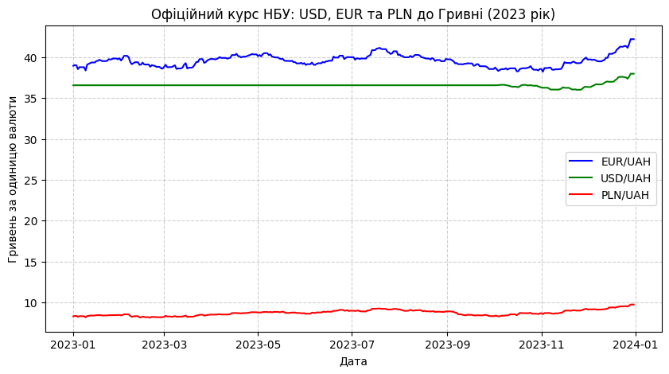
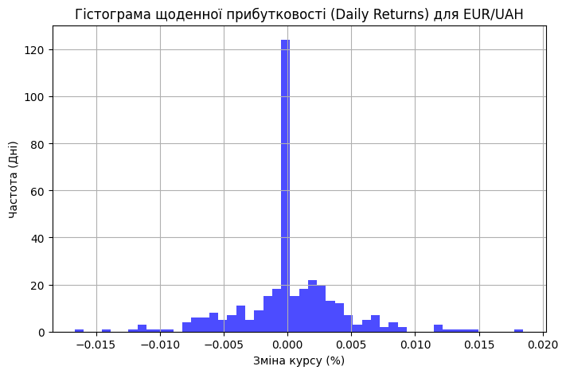
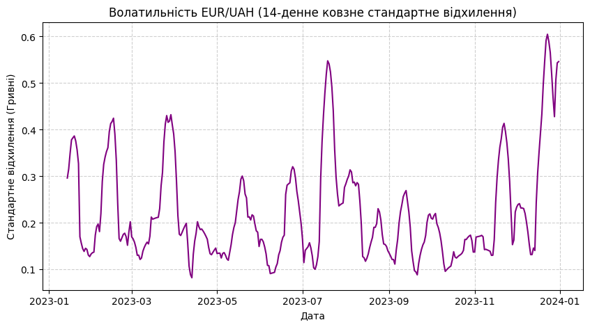
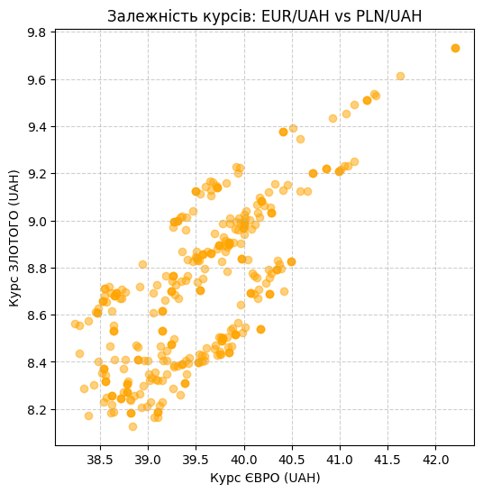

# Звіт: Модуль 2 (Варіант 8 - Офіційні курси НБУ)
- **Час генерації**: 2026-05-16 14:33
- **Сирий датасет**: `data/raw/exchange_rates.json`
- **Очищений датасет**: `data/processed/clean.csv`

## Опис очистки даних
Дані зібрані через API Національного банку України. Оскільки НБУ публікує курси для кожної валюти окремо, вони були об'єднані в єдиний DataFrame за датою. Застосовано `Forward Fill` для заповнення курсів на вихідні дні.
```json
{
  "shape_before": [
    365,
    4
  ],
  "missing_before": 0,
  "duplicates_before": 0,
  "shape_after": [
    365,
    7
  ],
  "missing_after": 0,
  "duplicates_after": 0
}
```

## Візуалізації
### line_trend


### hist_returns


### rolling_std


### scatter_corr


## Інтерпретація та висновки
1. **Фіксований курс**: На графіку `line_trend` чітко видно, що курс USD/UAH був жорстко зафіксований НБУ на рівні 36.56 грн більшу частину 2023 року, і лише восени перейшов у режим керованої гнучкості.
2. **Динаміка євровалют**: Натомість EUR та PLN коливалися відповідно до ситуації на міжнародних ринках (крос-курси відносно долара).
3. **Волатильність**: Графік `rolling_std` для Євро показує, що періоди найбільшої нестабільності курсу припадали на середину літа та осінь 2023 року.
4. **Кореляція європейських ринків**: `scatter_corr` демонструє ідеальну лінійну залежність між Євро та Польським злотим, оскільки економіка Польщі тісно прив'язана до єврозони.
5. **Практична цінність**: Дані успішно очищені та зведені. Виявлені інсайти щодо фіксованого курсу долара підтверджують важливість аналізу не лише однієї валюти, а цілого кошика для розуміння реальної вартості національних грошей.